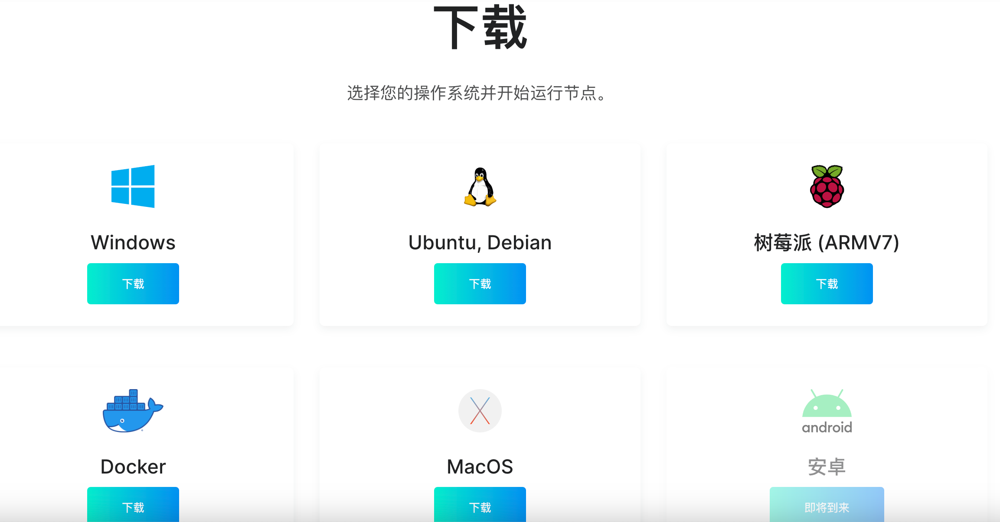
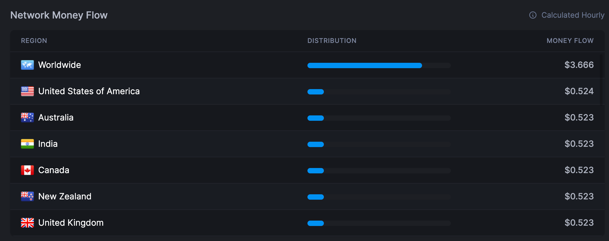
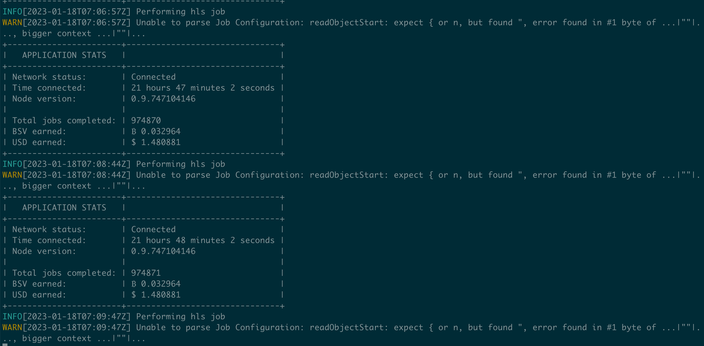
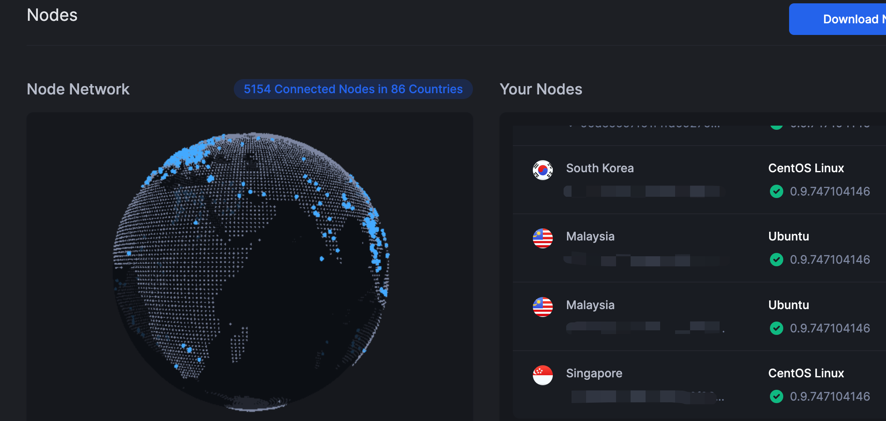

## Bitping 简介

[Bitping](https://www.bitping.com/)是一款的"Share to Earn"分享网路节点挂机项目，总部在新加坡，公司规模不大，目前只有员工4个人，算是一个新兴挂机项目。 Bitping提供「测试、监控、防护」三种网路服务给终端客户。而身为用户的我们则透过下载Bitping的Nodes节点，提供自身的大数据及设备算力资源给公司运用，让他们可以借力使力赚钱，然后再分一些利润给我们。

### 注册

[注册地址](https://app.bitping.com?r=d9LM79jw)

目前注册应该没有新人优惠，因为项目还算是比较新

### 支持平台



### 部分地区流量单价

截取于2023-01-18



## 节点部署

### Windows

[Windows压缩安装包](https://downloads.bitping.com/node/windows.zip)

### Linux

[Linux-ZIP压缩包](https://downloads.bitping.com/node/linux.zip)

### 树莓派

[树莓派32位-ZIP压缩包](https://downloads.bitping.com/node/armv7.zip)

### 容器Docker

```shell
## 运行
docker run -it --name bitping --mount type=bind,source="$HOME/.bitping/",target=/root/.bitping bitping/bitping-node:latest
```

运行后会输出几个日志，然后让你填写账号密码，填写完成后就能正常运作。不过此时容器还在前台工作，我们要先`Ctrl+C`退出容器，然后重新`docker start bitping`这样容器就能在后台运行了，也不用再次输入上好密码，因为输入一次，只要容器不删掉（停掉没问题）那密码是会记录的

### MacOS

[MacOS压缩包](https://downloads.bitping.com/node/macos.zip)

除了Docker部署以外，其他下载都是压缩包。解压之后是一个`release`文件夹，然后进入终端（windows系统使用powershell）然后进入`release`目录，首先运行（以Linux系统为例，其他系统要以实际文件运行

```shell
## Linux
./bitping-node-amd64-linux --server
## 然后输入bitping的账号密码，登陆成功后Ctrl+C退出
## 最后执行多一次
nohup ./bitping-node-amd64-linux --server &
# 就可以放到后台跑了
```

### 正常运行



有警告信息不用理会，主要是看完成的任务数来发放奖励的。

## 结束语

Bitping的好处在于能加入服务器`IP`，把闲置的服务器资源都利用上，而且部署还算简单，直接一个二进制文件就完事，关于收益速度目前我好几个服务器都在跑，收益一个月大概一刀左右



其他网赚介绍文章：

- [网络流量被动收入之Honeygain Docker部署教程](https://yysy.site/p/passive-income-honeygain/)
- [网络流量被动收入之Traffmonetizer Docker部署教程](https://yysy.site/p/passive-income-traffmonetizer)
- [网络流量被动收入之Packetstream Docker部署教程](https://yysy.site/p/passive-income-packetstream)
- [网络流量被动收入之Iproyal Docker部署教程](https://yysy.site/p/passive-income-iproyal)
- [网络流量被动收入之Peer2profit Docker部署教程](https://yysy.site/p/passive-income-peer2profit)
- [网络流量被动收入之Earnapp Docker部署教程](ttps://yysy.site/p/passive-income-earnapp)
