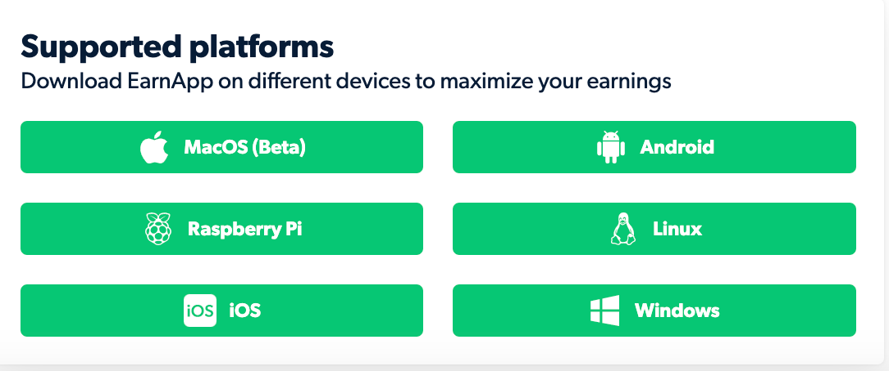
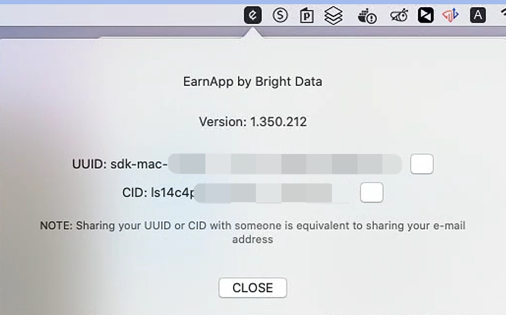
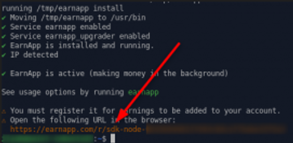

## Earnapp 是什么

EarnApp 是一个把没用完的网路流量卖给 EarnApp 这家公司（母公司是BrightData）的一个 App
假设我们每个人家里都有 Wi-Fi，手机也都用吃到饱，但我们是否无时无刻都在用这些网路流量呢？
若没有的话，我们其实就可以用 EarnApp 这个客户端把闲置流量/带宽变现

### 注册

[注册地址](https://earnapp.com/i/r28ipAVe)

目前新用户注册没有奖励计划

### 优缺点

#### 优点

- 一个`IP`能下接入多台设别（无限制）
- 适用平台比较多，MacOS、Android、树莓派、Linux、IOS、Windows



#### 缺点

- 仅限家宽`IP`使用
- 出金方式较为单一，只有Paypal，手续费会较高
- 流量单价较低，好像我挂中国香港`IP`和国内`IP`，单价均是0.24美元/GB，其他地区未知，因为需要家宽`IP`
- 2023-01-21此时笔者的MacOS客户端能启动，但是没办法转发流量进行收益，已和Earnapp的技术支持沟通

## 部署

### MacOS

[PKG安装包下载地址](https://cdn.earnapp.com/static/earnapp-macos-1.350.212.pkg)

安装后打开，右上角会有一个"E"图标的程序，点击，选择"About"，查看ID信息



点击"UUID"最右边的按钮复制，然后在**已经登陆**的[Dashboard界面](https://earnapp.com/dashboard)，地址栏再打开链接 `https://earnapp.com/r/<刚才复制的UUID>`，页面就会添加到对应节点

### Android

[APK安装包下载地址](https://cdn.earnapp.com/static/earnapp-1.341.430.apk)

同上操作添加节点到页面

### IOS

[App Store对应产品地址](https://apps.apple.com/us/app/bright-rewards-earn-cash/id1645893250)

### Windows

[EXE下载地址](https://cdn.earnapp.com/static/earnapp-setup-1.351.6.exe)

### Linux/树莓派

输入命令

```shell
wget -qO- https://brightdata.com/static/earnapp/install.sh > /tmp/earnapp.sh && sudo bash /tmp/earnapp.sh
```

等待一键脚本完成，跑完之后输入

```shell
earnapp register
```

脚本会显示出以下地址



同样把地址输入地址栏打开，就可以添加节点了

### Docker

[Docker部署请参考]((https://yysy.site/p/docker-installation))

先执行文件夹创建，存在earnapp生成的文件

```shell
mkdir $HOME/earnapp-data
```

然后执行

```shell
docker run -d --privileged -v /sys/fs/cgroup:/sys/fs/cgroup:ro -v $HOME/earnapp-data:/etc/earnapp --name earnapp fazalfarhan01/earnapp
```

坑1：这里适合的是linux系统，如果是和笔者都是用macOS系统的话，目前他们那个版本是无法产生流量的，因此我们还是要考虑docker版本

Mac的docker需要进行如下修改

1. 检查`cat ~/Library/Group\ Containers/group.com.docker/settings.json|grep deprecatedCgroupv1` 是否为false
2. 加入是true就不用管，可以直接使用docker命令
3. 如果是false的话，需要把对应的值改成true，重启docker，并且`/sys/fs/cgroup`在MacOS中是没有的，因此需要跑一个centos或者ubuntu镜像` docker run -d --name earnapp centos:7 /usr/sbin/init`，然后使用命令`wget -qO- https://brightdata.com/static/earnapp/install.sh > /tmp/earnapp.sh && sudo bash /tmp/earnapp.sh` 进行安装

执行完成后运行

```shell
docker exec -it earnapp earnapp showid
```

然后输出的地址同样在已经登陆的earnappdashbarod浏览器中打开即可添加节点。

## 结束语

Earnapp收益是这么多网赚里面比较低的一个，也有可能和我用国内`IP`有关，但是也不至于没用，反正也不需要动的就就让他挂着，也不会耗什么资源，反正少就少吧，蚊子再小也是肉。

- [网络流量被动收入之Traffmonetizer Docker部署教程](https://yysy.site/p/passive-income-traffmonetizer)
- [网络流量被动收入之Bitping Docker部署教程](https://yysy.site/p/passive-income-bitping)
- [网络流量被动收入之Traffmonetizer Docker部署教程](https://yysy.site/p/passive-income-traffmonetizer)
- [网络流量被动收入之Iproyal Docker部署教程](https://yysy.site/p/passive-income-iproyal)
- [网络流量被动收入之Peer2profit Docker部署教程](https://yysy.site/p/passive-income-peer2profit)

- [网络流量被动收入之Honeygain Docker部署教程](https://r.honeygain.me/JJC27EFDE4)

