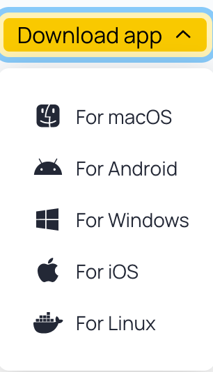
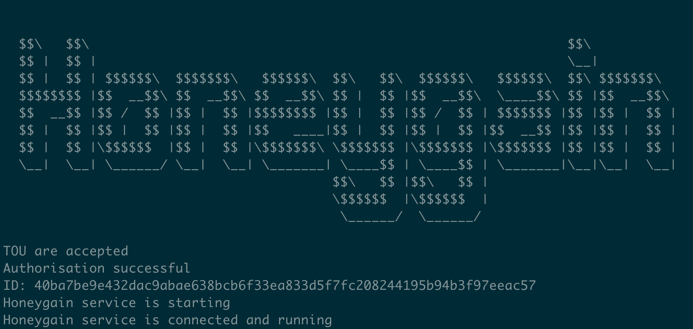
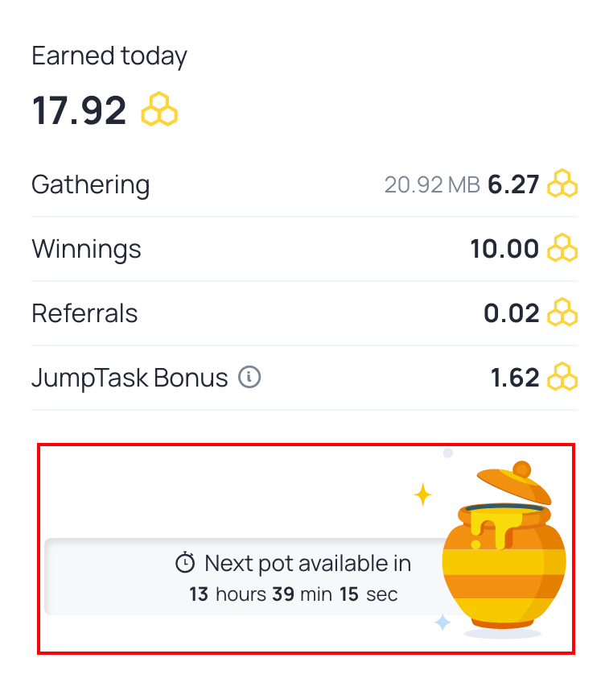

## Honeygain 是什么

[HoneyGain](https://www.honeygain.com/) 是一个通过共享自己闲置不用的网络带宽赚钱的平台。HoneyGain 支持多种不同的操作系统和设备，安装后既可自动分享闲置的网络带宽，分享的越多，赚得越多，是一个完全免费、简单易用、有网络就能用的 “躺赚” 被动收入平台。

HoneyGain 应该算是众多网络共享平台里**最流行的**，而且网上非常多的人已经真实的拿到了现金奖励，可以说是一个非常靠谱的平台。

### 注册

新用户注册会送5美元奖励，[注册链接](https://r.honeygain.me/JJC27EFDE4)。

默认Honeygain是满20美元提现（通过`paypal`手续费较高），不过现在有一个`JumpTask`的模式，和电子货币平台合作（手续费较低，而且不限制提现额度），不过涉及电子货币需要对应的电子钱包。

## Honeygain 的收益如何

首先要先明确，使用`Honeygain`客户端跑的结果**并不是**直接的收益，而是`honeygain`的积分。按照官网说法，每1000积分对应的是1美元，而10MB流量对应3积分，也就是大概1美元/3GB流量。


截止2023-01-16，笔者还没有提现，不过在`JumpTask`是能够按照操作提现到对应地址钱包的，所以提现应该问题不大。笔者从2022年大概9月、10月左右开始玩，一开始的收益（3个设备）有大概50-80积分是浮动，折算回来每天大概0.05-0.08美元/天，而且这个估计和国内网络有关，连接hoenygain的服务器质量比较差可能是，所以跑的流量稍微低一些。

## Honeygain 优缺点

### 优点

1. 老牌闲置带宽兑现的厂商
2. 目前支持的`JumpTask`平台能把提现门槛降低
3. 分别有几种积分获取途径，除了纯挂机，调整为`JumpTask`模式也能稍微提高一些收益，还有就是每日`Winnings`，以前是手点，后面其实有人写了脚本，我这边也整理了出来，增加收入来源

### 缺点

1. **只能家宽**`IP`，否则会**运行失败**，提示`Not Resdential ip`
2. 同一个出口`IP`只能有一个设备挂着，否则会提示`OverUsed`
3. 国内`IP`访问可能会有时候连接失败，因为官网使用`Cloudflare CDN`有时候国内网络到海外会延迟较大，客户端访问`API`会报错，这也是影响收益的原因之一

## Honeygain 部署

Honeygain 目前支持MacOS、Android、Windows、IOS、Linux



桌面端和移动端，可以直接通过[注册](https://r.honeygain.me/JJC27EFDE4)，登陆[Dashboard](https://dashboard.honeygain.com/#)，右上角可以自行下载，这里不展开讨论，都是按照步骤安装而已。

**备注**：个人建议优先推荐桌面端，能打开`Content Delivery`功能，理论上是`CDN`的功能，不过笔者目前还没有看到这个类别的收入。不过桌面端的客户端我这边跑了几个月，看起来分配的流量比容器部署更加多。

### Docker 容器化部署

Docker安装这里不展开描述，可以参考文章  [Docker安装部署](https://yysy.site/p/docker-installation/)

Honeygain一键安装命令

```shell
docker run -d --name honeygain --restart=always honeygain/honeygain -tou-accept -email <邮箱地址-账号名> -pass <密码> -device <设备名>
```

- `email` 参数后需要替换为你 `Honeygain` 对应的账号名，一般是邮箱地址
- `pass` 参数后需要替换为你 `Honeygain` 对应的密码
- `device` 参数后需要替换为你这个设备的名字，如果成功的话[Dashboard](https://dashboard.honeygain.com/#)页面中`My active devices`会看到在线

执行后可以通过命令行查看日志

```shell
docker logs -f honeygain
```

返回如下图



## (可选) Winnings 自动获取脚本

现在`Honeygain`的[Dashboard界面](https://dashboard.honeygain.com/#)每天会有一个蜜罐，是随机发放积分的，不过需要跑够一定流量之后才能打开，而且每天都要操作的话比较麻烦，不符合网赚挂机躺赚原则，所以这边分享一个脚本，可以检测流量是否满足打开这个蜜罐的动画，如果满足的话脚本会调用api领取积分。



脚本（Honeygain_checkin.py）内容，需要在`USERNAME`和`PASSWORD`填入你对应`Honeygain`的账号密码，运行前需要安装`pyHoneygain==0.3.5`和`requests`模块

```python
#!/usr/bin/env python
from datetime import date
import os,sys
from pyHoneygain import HoneyGain
import requests
import time

t = time.time()
time_string = time.strftime("%Y-%m-%d %H:%M:%S", time.localtime(t))
utc_t = time.time() - 8 * 60 * 60
utc_time_string = time.strftime("%Y-%m-%d", time.localtime(utc_t))

# Your HoneyGain (HG) login username and password
USERNAME = ""
PASSWORD = ""

# Initialise the HoneyGain object
user = HoneyGain()

# Call the login method
user.login(USERNAME, PASSWORD)

user_balance = "\nUser HG balance {}, JT balance {}".format(user.wallet_stats()["data"]["{}".format(utc_time_string)]["hg_credits"], user.wallet_stats()["data"]["{}".format(utc_time_string)]["jt_credits"])
honeypot_status = user.get_honeypot_status()
message = "error"
if str(honeypot_status["winning_credits"]) != "None":
    message = "{} already claimed the honeypot today.{}".format(user.me()['email'],  user_balance)
else:
    if honeypot_status["progress_bytes"] == honeypot_status["max_bytes"]:
        result = user.open_honeypot()
        if result["success"]:
            message = "Opened honeypot for {}, resulting in {} credits.{}".format(user.me()['email'], result["credits"], user_balance)
        else:
            message = "Couldn\'t open honeypot for {}, unknown error.{}".format(user.me()['email'], user_balance)
    else:
        message = "Couldn\'t open honeypot for {}, did not gather 15MB.{}\nProgress in bytes: {} - 15000000".format(user.me()['email'], user_balance, user.get_honeypot_status()["progress_bytes"])

print(message)
```

## 结束语

如果有其他疑问或者部署上有什么难题，欢迎联系 [我](mailto:jjc27017@gmail.com) 或者加入 [讨论群](https://t.me/yysy_blog_chat) 一起讨论

其他网赚/网络流量挂机/被动收入项目：

- [网络流量被动收入之Traffmonetizer Docker部署教程](https://yysy.site/p/passive-income-traffmonetizer)
- [网络流量被动收入之Bitping Docker部署教程](https://yysy.site/p/passive-income-bitping)
-  [网络流量被动收入之Traffmonetizer Docker部署教程](https://yysy.site/p/passive-income-traffmonetizer)
-  [网络流量被动收入之Iproyal Docker部署教程](https://yysy.site/p/passive-income-iproyal)
- [网络流量被动收入之Peer2profit Docker部署教程](https://yysy.site/p/passive-income-peer2profit)

- [网络流量被动收入之Earnapp Docker部署教程](ttps://yysy.site/p/passive-income-earnapp)

