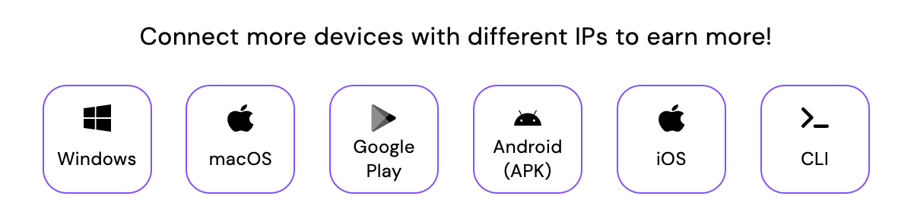
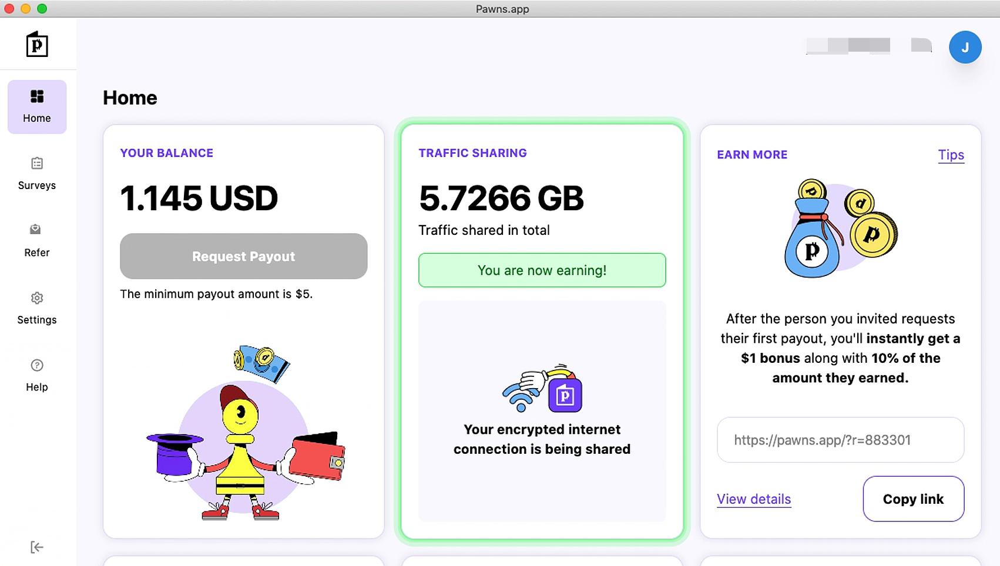

## Iproyal 是什么

IPRoyal Pawns，一家美国正规的IP代理公司，用户通过出售闲置带宽赚取佣金，从业务架构上分析合情合理，因为IPRoy需要P地址提供给客户使用，必须收集大量IP资源，对于用户来说，反正闲置带宽实属浪费，不如有效利用转化成真金白银。

### 注册

[注册地址](https://pawns.app?r=883301)，新用户注册送1美元的资金

### 限制

- 必须家宽`IP`，不能是服务器`IP`
- 提现金额是5美元（新注册赠送1美元）
- 提现方式是BitCoin、Paypal

### 收益

1美元/5GB

## 节点部署

目前（2023-01-19）平台支持的有Windows、MacOS、Android、IOS、Linux



### Windows

[下载地址](https://cdn.pawns.app/download/app/latest/windows/Pawns%20Setup.exe)

### MacOS

[下载地址](https://cdn.pawns.app/download/app/latest/darwin64/Pawns%20app.dmg)

运行后结果



### Google Play

[商店地址](https://play.google.com/store/apps/details?id=com.iproyal.android)

### Android APK

[下载地址](https://cdn.pawns.app/download/app/latest/android/Pawns%20app.apk)

### IOS

[商店地址](https://apps.apple.com/app/pawns-app-earn-money/id1626425873)

### Linux

`uname -a` 命令查看当前系统架构，确认好系统架构后按照对应选择下载二进制文件

[Linux aarch64](https://download.iproyal.com/pawns-cli/latest/linux_aarch64/pawns-cli)

[Linux ARM v7l](https://download.iproyal.com/pawns-cli/latest/linux_armv7l/pawns-cli)

[Linux ARM v6l][https://download.iproyal.com/pawns-cli/latest/linux_armv6l/pawns-cli]

[Linux ARM v5l](https://download.iproyal.com/pawns-cli/latest/linux_armv5l/pawns-cli)

[Linux i386](https://download.iproyal.com/pawns-cli/latest/linux_i386/pawns-cli)

[Linux x86_64](https://download.iproyal.com/pawns-cli/latest/linux_x86_64/pawns-cli)

启动命令

```shell
./pawns-cli -email=<change_to_email> -password=<change_to_password> -device-name=<change_to_device_name> -accept-tos
```

修改地方

1. `<change_to_email>`  ： 改成对应账号邮箱
2. `<change_to_password>` ：改成对应账号密码
3. `<change_to_device_name>` ：自定义设备名，标记用的

运行后等待几分钟，在[Dashboard](https://dashboard.pawns.app/)界面会看到已经激活的设备。

## 结束语

IProyal缺点还是仅限家宽`IP`，不能使用服务器`IP`。优点是支持平台多，而且有在线客服能问问题。由于笔者最近才加入，国内IP会偶尔请求API失效导致节点失联。而且没有每日统计流量还有每个节点的流量，只能通过每天的收入进度，大约估计收益速度还是可观的。反正节点越多，肯定就收益越快。其他网赚文章：

- [网络流量被动收入之Honeygain Docker部署教程](https://yysy.site/p/passive-income-honeygain/)
- [网络流量被动收入之Traffmonetizer Docker部署教程](https://yysy.site/p/passive-income-traffmonetizer)
- [网络流量被动收入之Packetstream Docker部署教程](https://yysy.site/p/passive-income-packetstream)

- [网络流量被动收入之Bitping Docker部署教程](https://yysy.site/p/passive-income-bitping)

- [网络流量被动收入之Peer2profit Docker部署教程](https://yysy.site/p/passive-income-peer2profit)
- [网络流量被动收入之Earnapp Docker部署教程](ttps://yysy.site/p/passive-income-earnapp)
