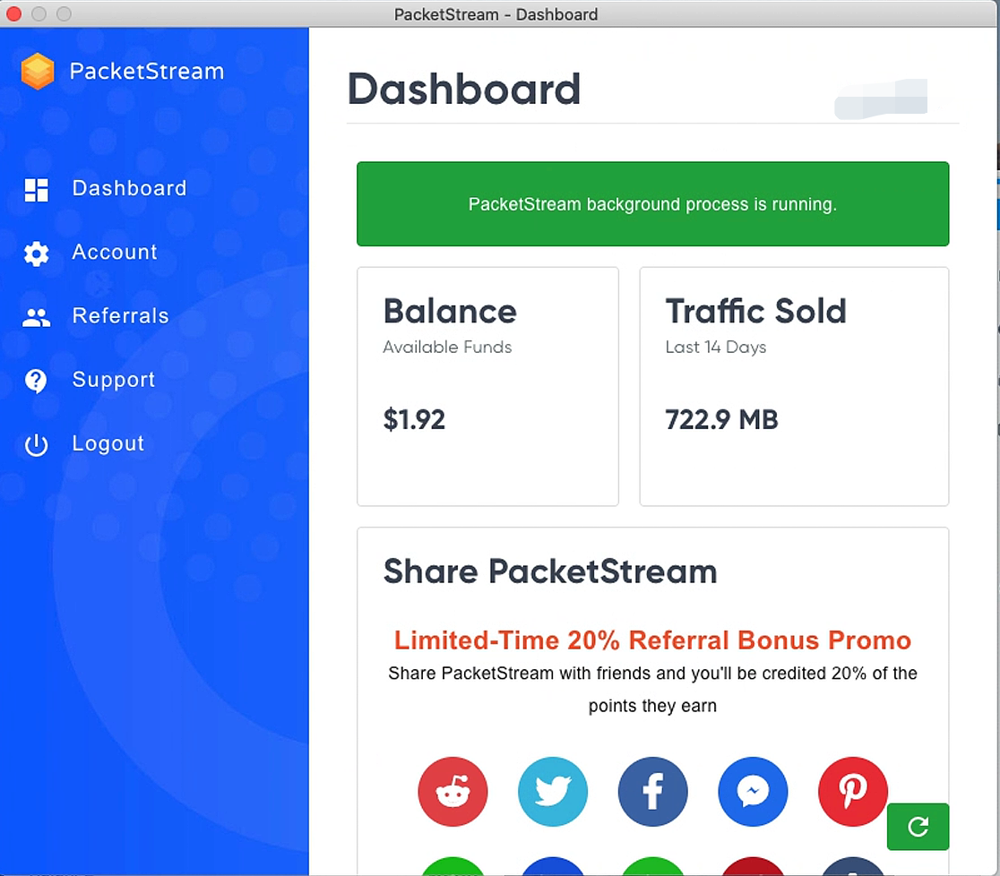
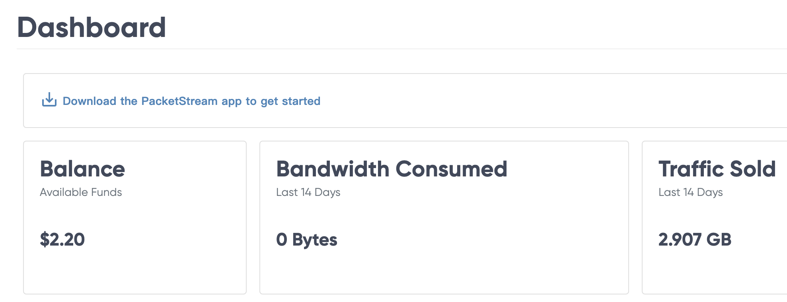

## Packetstream 简介

PacketStream是一个成立于2018年的P2P点对点代理网络平台，允许用户将自己的闲置带宽进行共享以获得相应的报酬，此外可以让客户从共享者共享的IP地址进行网络访问，总的来说PacketStream就是一个流量买卖平台。

PacketStream的运作原理是将共享者与客户连接起来，通过将你共享的带宽以更高的价格出售给想使用你的IP地址的人,而客户愿意付费从你的 IP 地址访问互联网，主要的原因有很多种：

- 访问受地区限制的内容（例如Netflix）
- 不想暴露自己的网络信息
- 进行网络信息的爬取

### 注册

目前新用户注册可以免费获得5美元的额度，[注册地址](https://packetstream.io/?psr=4EBX)。

接下来再用节点挂机跑流量多5美元即可出金，出金方式目前知道的有Paypal、BTC、Payoneer，官方到账时间宣称是48小时，最低提现门槛是10美元。

## Packetstream 收益

官网上显示的收入如下图，我们身份是左边，作为共享带宽的一方，所以是0.1美元/Gb，单价还算较高。


提现界面也有相关字段，说会收3%的平台费，目前看到提现方式只有通过`Paypal`邮箱进行提取。

## Packetstream 支持平台

目前Packetstream支持三个平台，分别是MacOS、Windows（64位）还有Linux。

### MacOS 部署

[dmg下载地址])(https://s3-us-west-2.amazonaws.com/packetstream-releases/latest/PacketStream.dmg)



### WIndows 部署

[exe下载地址](https://s3-us-west-2.amazonaws.com/packetstream-releases/latest/PacketStream.exe)

### Linux 部署

```shell
sudo docker rmi packetstream/psclient; sudo docker run -d --restart=always -e CID=4EBX --name psclient packetstream/psclient:latest 
sudo docker run -d --restart=always --name watchtower -v /var/run/docker.sock:/var/run/docker.sock containrrr/watchtower --cleanup --include-stopped --include-restarting --revive-stopped --interval 60 psclient
```

不过亲测，其实打开watchtower也影响不大，直接一个·pslicnet`容器即可，因为命令行已经上了少补。

## 结束语

该厂商缺点是需要家宽`IP`地址，服务器地址无法使用。另外部署中那个watchtower初步判断只是一个守护进程，但是那个守护进程貌似消耗资源有点高（在我这边）所以我只是保留了psclient的容器。以下是兑现截图和`dashboard`部分截图。另外，如果发邮件去他们support其实也有回应的，不至于没反馈，这点还不错。




其他网赚介绍文章：

- [网络流量被动收入之Honeygain Docker部署教程](https://yysy.site/p/passive-income-honeygain/)
-  [网络流量被动收入之Traffmonetizer Docker部署教程](https://yysy.site/p/passive-income-traffmonetizer)
-  [网络流量被动收入之Bitping Docker部署教程](https://yysy.site/p/passive-income-bitping)
-  [网络流量被动收入之Iproyal Docker部署教程](https://yysy.site/p/passive-income-iproyal)
-  [网络流量被动收入之Peer2profit Docker部署教程](https://yysy.site/p/passive-income-peer2profit)
- [网络流量被动收入之Earnapp Docker部署教程](ttps://yysy.site/p/passive-income-earnapp)

- [网络流量被动收入之Repocket Docker部署教程](https://yysy.site/p/passive-income-repocket)
