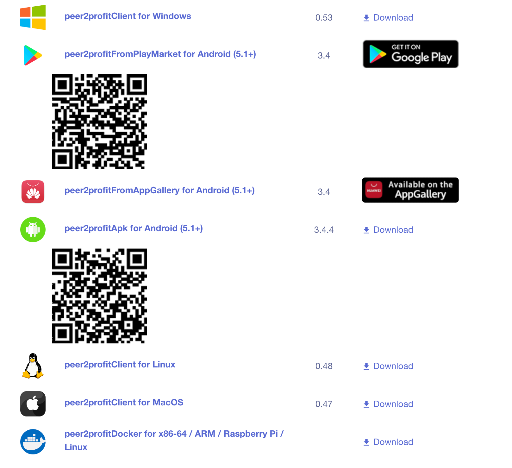
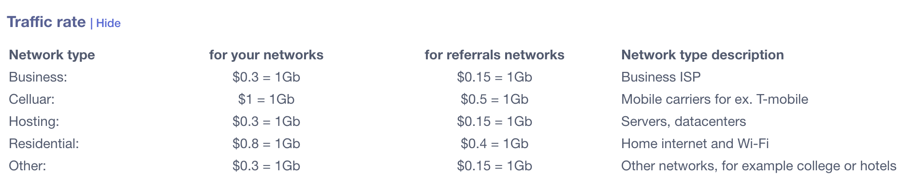
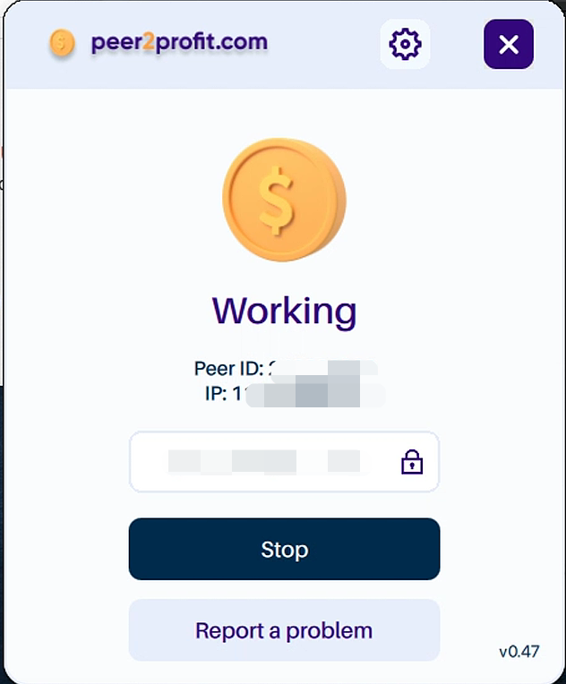
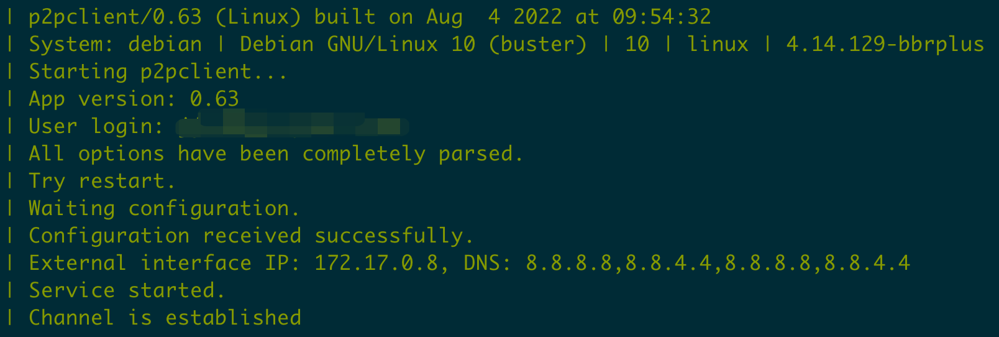

## Peer2profit 简介

Peer2Profit（简称为p2pr）是一款可以利用你的闲置网络带宽赚钱的平台，支持包括Windows、MacOS、Linux、iOS、Android 等等几乎所有平台。 我们平常使用的网络其实并不会用完所有的流量和带宽，Peer2Profit 就可以帮我们利用好这一部分资源，并且根据流量给予我们一定的奖励。

### 注册

[注册地址](https://p2pr.me/1663055104632035000e461)

目前新注册没有激励计划

### 支持平台

Windows / Google Play / AppGallery / Android / Linux / MacOS / Docker



### 提现方式

有很多种，主要是电子钱包还有加密货币两个大种类，至少2美元才能提现


### 流量单价



价格不算高，如果是手机移动网络的`IP`会比较高，其他网络类型的`IP`个人感觉单价较低

## 部署

下载信息更新于2023-01-20

### Windows

[安装压缩包地址](https://updates.peer2profit.app/Peer2Profit-Setup_0_53_signed.zip)

### Google Play

[商店地址](https://play.google.com/store/apps/details?id=com.peer2profit.app)

### AppGallery

[商店地址](https://appgallery.cloud.huawei.com/ag/n/app/C105044861?channelId=Website&id=2ed86f9d0dfe4e9bb435f351a003fc94&s=7F50B4C918591EE125E0EE10D28D1D0EC1E38E5D80B2FD7CED476AF73BE0F71A&detailType=0&v=&callType=AGDLINK&installType=0000)

### Android APK

[安装包APK下载地址](https://updates.peer2profit.app/P2P_3.4.4_(53)-release.apk)

### Linux (Deb)

[安装包deb下载地址](https://updates.peer2profit.app/peer2profit_0.48_amd64.deb)

### MacOS

[安装包DMG下载地址](https://updates.peer2profit.app/Peer2Profit-0.47.dmg)



### Docker

[Docker Hub地址](https://hub.docker.com/r/peer2profit/peer2profit_linux)

运行命令

```shell
docker run -d --restart unless-stopped -e P2P_EMAIL=<change_to_email> --name peer2profit peer2profit/peer2profit_linux:latest 
```

修改内容：

1. `<change_to_email>` ：修改为 `peer2profit` 你账号对应的邮箱地址

`docker logs -f peer2profit` 显示的日志为

这样程序就跑起来了，在 [My Network](https://dashboard.peer2profit.app/proxypeers) 页面可以看到对应节点已经在线。

## 结束语

`Peer2profit`也是一个不限制`IP`，无论家宽还是服务器`IP`都能参与的挂机项目，实测之后发现是海外服务器IP反而跑的流量会比国内家宽要高，可能还是与网络因素有关，不过整体的流量单价较低，所以相对其他网赚平台的话，他收益速度慢一些和收益额相对会少一些。

其他网赚文章：

- [网络流量被动收入之Honeygain Docker部署教程](https://yysy.site/p/passive-income-honeygain/)
- [网络流量被动收入之Traffmonetizer Docker部署教程](https://yysy.site/p/passive-income-traffmonetizer)
- [网络流量被动收入之Packetstream Docker部署教程](https://yysy.site/p/passive-income-packetstream)
- [网络流量被动收入之Bitping Docker部署教程](https://yysy.site/p/passive-income-bitping)
- [网络流量被动收入之Iproyal Docker部署教程](https://yysy.site/p/passive-income-iproyal)
- [网络流量被动收入之Earnapp Docker部署教程](ttps://yysy.site/p/passive-income-earnapp)