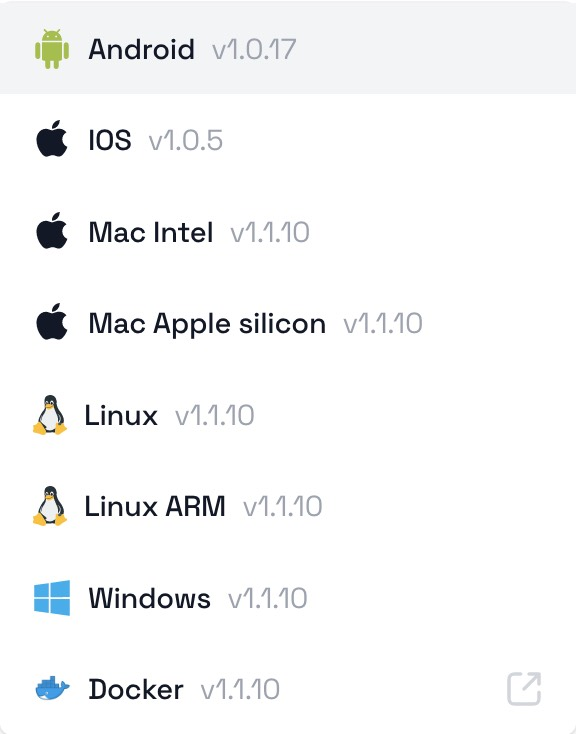

## Repocket 简介

[Repocket](https://app.repocket.co/)是一款类似「Honeygain、Peer2Profit」的流量挂机项目，但目前还不知道公司所在地，最近才刚推出来，已有不少国外youtuber网红介绍，真实性很高。根据大鲁蛇的经验，这种流量挂机项目都蛮稳定，因此出金的可能性不用太担心，因此我就先发文介绍，有兴趣的可以先下载来试试看。

### 注册

[注册地址](https://link.repocket.co/undefined)

目前通过上述注册链接，有5美元新人注册优惠

### 支持平台



### 流量单价

暂时未知

## 节点部署

### Android

[APK安装包](https://repocket-production.s3.fr-par.scw.cloud/apk/1.0.0/release_1.0.17.apk)

### IOS

[Apple Store商店地址](https://apps.apple.com/il/app/repocket-make-money-daily/id6443986417)

### Mac

[Intel DMG安装包](https://repocket-production.s3.fr-par.scw.cloud/repocket-desktop/updates/Repocket-1.1.10.dmg)

[Apple silicon安装包](https://repocket-production.s3.fr-par.scw.cloud/repocket-desktop/updates/Repocket-1.1.10-arm64.dmg)

### Linux

[AMD架构](https://repocket-production.s3.fr-par.scw.cloud/repocket-desktop/updates/Repocket-1.1.10.AppImage)

[ARM架构](https://repocket-production.s3.fr-par.scw.cloud/repocket-desktop/updates/Repocket-1.1.4-arm64.AppImage)

### Windows

[EXE安装包](https://repocket-production.s3.fr-par.scw.cloud/repocket-desktop/updates/Repocket%20Setup%201.1.10.exe)

### 容器Docker

[Docker Hub地址](https://hub.docker.com/r/repocket/repocket)

```shell
## 运行
docker run -e RP_EMAIL=<your_email_address> -e RP_PASSWORD=<your_password> -d --name repocket --restart=always repocket/repocket
```

修改`<your_email_address>`为`Repocket`登陆邮箱名，`<your_password>`为`Repocket`登陆密码，运行即可

### 正常运行

```shell
docker logs -f repocket
```

结果出现`Connection established`即为部署成功，正常运行。目前(2023-02-10)平台还没有提供运行设备的界面。

## 结束语

`Repocket`的优缺点都比较明显，优点是能支持家宽和IDC的服务器，部署比较简单，支持平台比较多。缺点就是中国大陆网络无法使用（官方discord群里面有admin是说可以使用，这里有矛盾），而且目前出金速度和方式并不明确，网站仍然在开发中。

其他网赚介绍文章：

- [网络流量被动收入之Honeygain Docker部署教程](https://yysy.site/p/passive-income-honeygain/)
- [网络流量被动收入之Traffmonetizer Docker部署教程](https://yysy.site/p/passive-income-traffmonetizer)
- [网络流量被动收入之Packetstream Docker部署教程](https://yysy.site/p/passive-income-packetstream)
- [网络流量被动收入之Iproyal Docker部署教程](https://yysy.site/p/passive-income-iproyal)
- [网络流量被动收入之Peer2profit Docker部署教程](https://yysy.site/p/passive-income-peer2profit)
- [网络流量被动收入之Earnapp Docker部署教程](ttps://yysy.site/p/passive-income-earnapp)

- [网络流量被动收入之Bitping Docker部署教程](https://yysy.site/p/passive-income-bitping)