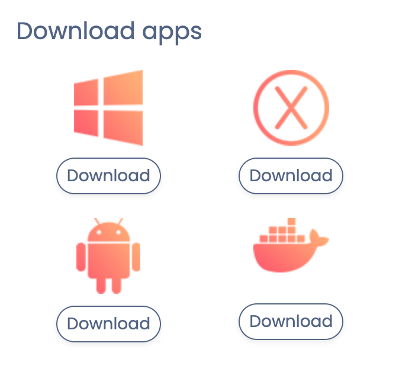
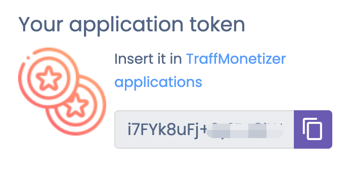
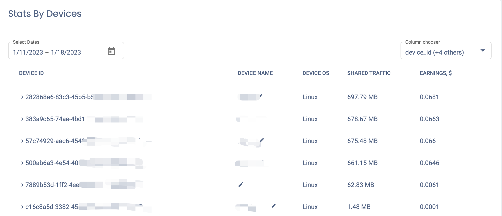

## Traffmonetizer 是什么

[Traffmonetizer](https://traffmonetizer.com/)是一款欧洲爱沙尼亚的流量挂机项目，跟Honeygain、Peer2profit等同一类，推出后已在不少国外论坛中介绍。
Traffmonetizer目前支持Windows、Android、MacOS、Docker平台



Traffmonetizer可以同一个帐户连结无限设备，适合多部装置同时操作。使用者须在挂机装置中输入官方发给的"Token"作为识别，不像其他挂机项目要输入注册电邮方式不同，运作上反而比较简便。

### 注册

目前新用户注册可以免费获得5美元的额度，[注册地址](https://traffmonetizer.com/?aff=531433)。

接下来再用节点挂机跑流量多5美元即可出金，出金方式目前知道的有Paypal、BTC、Payoneer，官方到账时间宣称是48小时，最低提现门槛是10美元。

## Traffmonetizer 优缺点

### 优点

1. 容器部署方便，简单快捷
2. 不需要局限家宽`IP`，服务器`IP`也可以，建议非国内`IP`，跑的流量会更高
3. 流量单价不算高，1美元/10GB，但是分配的流量还算挺多

### 缺点

1. 仅支持4个平台(Windows/MacOS/Android/Docker)，暂时未有树莓派或者linux等资源较少的设备支持
3. 日志不清晰，有时候报错的话也不用管，看`Dashboard`每天有流量就行

## Traffmonetizer 部署

### Windows 部署

[安装包下载地址](https://data.traffmonetizer.com/downloads/Installer.exe)

### MacOS 部署

[安装包下载地址](https://data.traffmonetizer.com/downloads/macos/traffmonetizer.dmg)

### Android 部署

[安装包下载地址](https://play.google.com/store/apps/details?id=com.traffmonetizer.client)

以上三个平台均安装对应包后打开，然后填入[Dashboard](https://app.traffmonetizer.com/dashboard) 上的`token`，运行服务即可。



### Docker 部署

[官方Docker Hub地址](https://hub.docker.com/r/traffmonetizer/cli)

#### 拉取镜像

普通linux64位 / AMD64:

```
docker pull traffmonetizer/cli:latest
```

ARM 平台支持，主要是树莓派或者手机:

```
# 64位
docker pull traffmonetizer/cli:arm64v8       

# 32位
docker pull traffmonetizer/cli:arm32v7
```

#### 启动容器命令

```
docker run -d --restart unless-stopped --name tm traffmonetizer/cli start accept --token <dashboard主页上token>  --device-name <自定义名字>
```

内置命令参考

```shell
start - connects to the server
stop - disconnects from the server
accept - indicates that the application can accept traffic
end-accept - indicates that the application couldn’t accept traffic, but does not disconnect from the server
statistics - statistics. Outputted in the format "Inbound: {value}; Outgoing: {value}; Requests: {value}"
status - connection status. Outputted in the format "Connected: {True / False}; Accepting: {True / False}"
exit - stopping the application
```

启动之后可以在[Stats界面](https://app.traffmonetizer.com/stats)看到对应节点注册



## 结束语

Traffmonetizer 比较好的一点是对`IP` 没有那么严格的限制，走的服务器也行，平时如果有限制机器也可以跑一跑这个来回一下血。在笔者这边看来，用东南亚的节点来跑貌似也可以跑到稍微多一点流量，国内节点的话分配的流量较少。

其他被动网赚项目参考

- [网络流量被动收入之Honeygain Docker部署教程](https://yysy.site/p/passive-income-honeygain/)

- [网络流量被动收入之Traffmonetizer Docker部署教程](https://yysy.site/p/passive-income-traffmonetizer)
- [网络流量被动收入之Bitping Docker部署教程](https://yysy.site/p/passive-income-bitping)
-  [网络流量被动收入之Iproyal Docker部署教程](https://yysy.site/p/passive-income-iproyal)
-  [网络流量被动收入之Peer2profit Docker部署教程](https://yysy.site/p/passive-income-peer2profit)
-  [网络流量被动收入之Earnapp Docker部署教程](ttps://yysy.site/p/passive-income-earnapp)

- [网络流量被动收入之Repocket Docker部署教程](https://yysy.site/p/passive-income-repocket)
