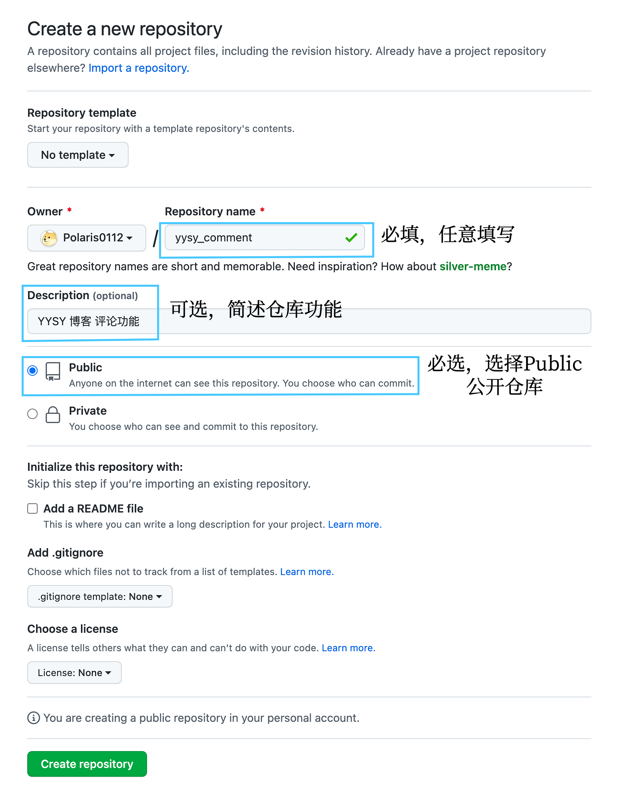
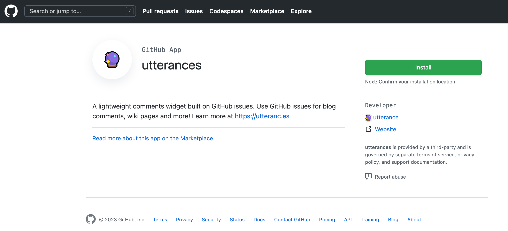
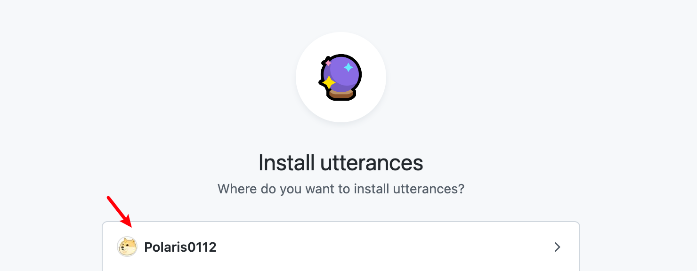
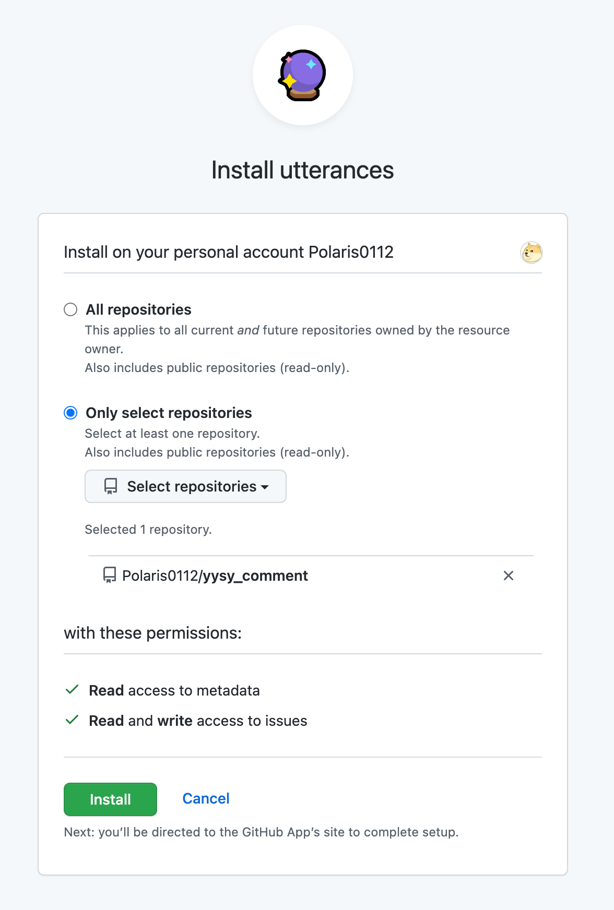
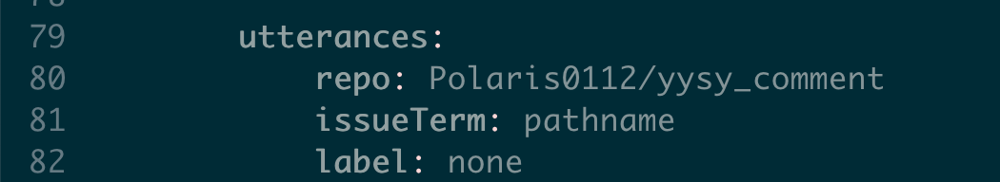
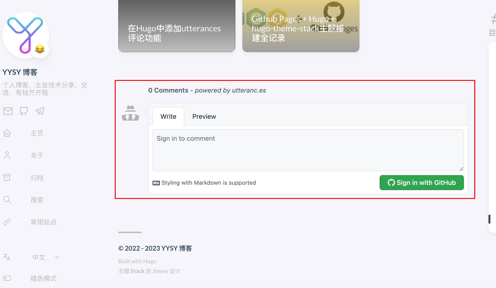

## 简介

utterances 是一款基于 GitHub issues 的评论工具 相比同类的工具 gitment、gitalk 以及 disqus 评论工具，优点如下：
- 极其轻量
- 加载非常快
- 配置比较简单
- disqus 这个工具配置也比较简单，也是免费的。但是，广告多，而且加载也比较慢
- utterances 基于github issue，拥有多种主题的开源免费小组件

## 部署

### 前期准备

- Github账号
- Hugo框架的博客

### Github仓库配置

1. 先创建`yysy_comment`仓库，仓库名可以自定义，不冲突就行。然后仓库依然选择`Public`公开仓库，因为评论功能需要利用到`Github`仓库的`Issue`功能

2. 安装 `utterances app`的安装较为简单，直接在`GitHub`上安装即可。`GitHub App`链接：`https://github.com/apps/utterances`访问`utterances`应用程序 然后点击`Install`按钮进行安装。选在在第一步创建的`yysy_comment`仓库

点击"Install"后完成`utterances`的安装。

### Hugo 配置

在`Hugo`主目录中找到目录文件`config.yaml`（有些教程写`config.toml`，可能是主题、版本不一样，现在我是使用`Hugo`版本是`hugo v0.96.0+extended`和主题`hugo-theme-stack`，所以配置文件是`config.yaml`）

一共修改三处地方，如下图：

1. `params.comments`位置中，`provider`字段改成`utterances`，下面的`utterances`字段中`repo`的值改成对上述创建的`Github`仓库名称，所以这里填入的是`Polaris0112/yysy_comment`，`issueTerm`的值填入`pathname`（保留原值），`label`的值填入`none`即可，如下图

### 最终效果

通过`Github`的`Issue`功能达到评论效果。

## 结束语

到这里已经完成评论功能添加，其他功能、插件的话可以参考其他文章

- 

