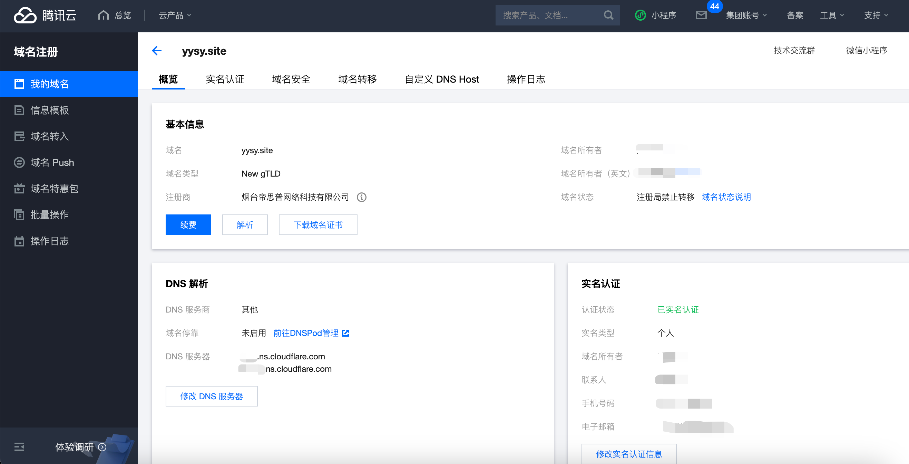
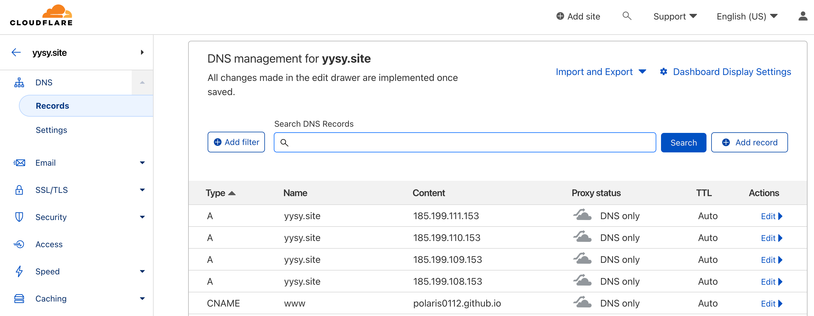
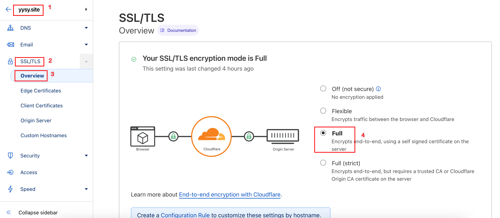
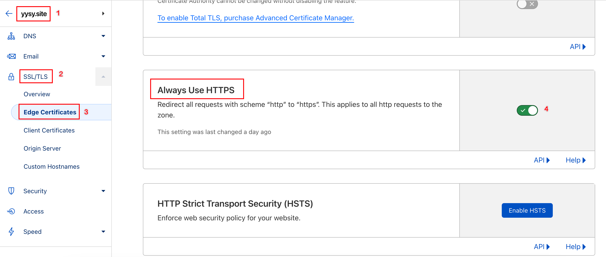
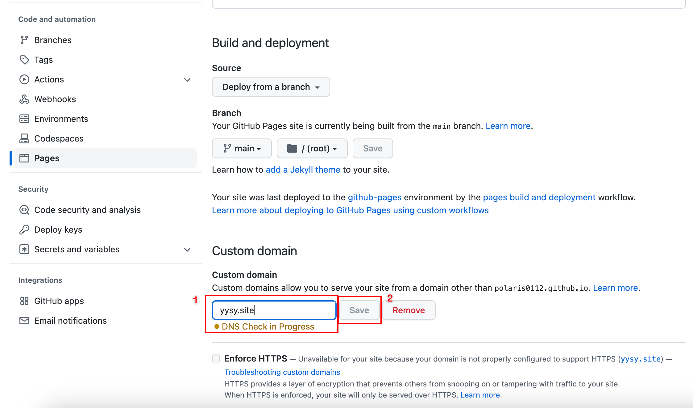
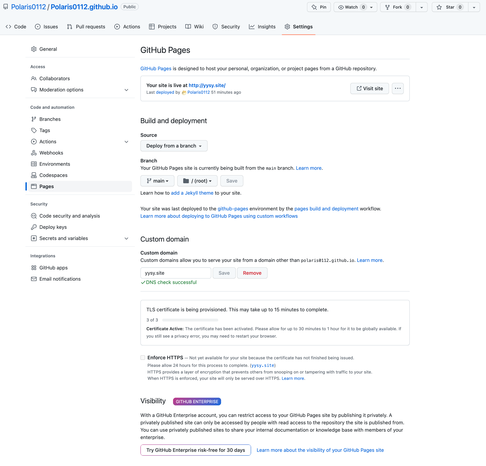

##  背景

从之前[部署博客](https://yysy.site/p/github-pages-hugo/)的文章可以获得一个无需自己购买服务器和域名的博客，并且能自主更新博客内容，再优化一下可以增加评论、统计访问量等插件。本文就是在这个基础上，继续低成本让个人博客使用自己的个人域名然后公网能支持HTTPS访问。

## 前期准备

- 一个域名（低成本建议使用腾讯云/阿里云按需购买）
- github pages配置完成的状态，能通过`<username>.github.io`正常访问
- 一个Cloudflare账号

## 部署配置

### 将域名转移到cloudflare托管

以腾讯云为例（因为我域名是在腾讯云买）



在“DNS解析”内容中，修改DNS服务器改成Cloudflare中添加站点后按照流程给出的NS服务器，对应填进去，等待几分钟之后Cloudflare就可以托管我们买的域名了。

原因：使用DNSpod也不是不行，但是Cloudflare的话可以白嫖他家的CDN（虽然本次不会用到），而且Cloudflare虽然我们是用免费的穷鬼套餐，不过配置项也不少，有很多配置项很有折腾空间（比如根据哪个地区解析成哪些IP，或者CName到哪些域名，这个有兴趣的同学可以研究一下）

只要Cloudflare中域名网站能设置DNS，可以自主添加一两个记录，测试一下解析结果，如果能正常解析就是托管成功，一般域名记录修改完几秒内就生效了。

### 添加DNS记录

| 类型  | 名称 |          值           |
| :---: | :--: | :-------------------: |
|   A   |  @   |    185.199.108.153    |
|   A   |  @   |    185.199.109.153    |
|   A   |  @   |    185.199.110.153    |
|   A   |  @   |    185.199.111.153    |
| CNAME | www  | polaris0112.github.io |



**注意**：暂时不建议使用CDN，因为会影响github解析校验流程。

尝试解析结果

```shell
nslookup yysy.site
## 结果返回
Server:		8.8.8.8
Address:	8.8.8.8#53

Non-authoritative answer:
Name:	yysy.site
Address: 172.67.220.171
Name:	yysy.site
Address: 104.21.70.63
```

这个是正常的，这两个IP是Cloudflare的CDN IP，因为`Proxy status`是打开的状态，所以对应的DNS配置都会走Cloudflare的CDN代理。

```shell
nslookup www.yysy.site
## 结果返回
Server:		8.8.8.8
Address:	8.8.8.8#53

Non-authoritative answer:
www.yysy.site	canonical name = polaris0112.github.io.
Name:	polaris0112.github.io
Address: 185.199.108.153
Name:	polaris0112.github.io
Address: 185.199.109.153
Name:	polaris0112.github.io
Address: 185.199.110.153
Name:	polaris0112.github.io
Address: 185.199.111.153
```

### 设置HTTPS

如下图，选择对应域名，然后进入"SSL/TLS" --> "Overview" ，在"Your SSL/TLS encryption mode"选择"Full"



如下图，选择对应域名，然后进入"SSL/TLS" --> "Edge Certificates" ，找到"Always Use HTTPS"点击右侧按钮，绿色✅即为打开跳转`https`



### 配置GitHub Pages仓库

**注意**：这里说的是`<username>.github.io`这个仓库，**不要**操作博客源代码仓库，不然无效。



填入自定义域名，然后“Save”保存，然后github会对该域名进行检查，主要是检查该域名是否指向github地址。

### 更新博客源文件/博客静态文件

1. 上述步骤操作后我们需要修改博客源文件，`yysy`目录下`config.yaml`需要把第一行`baseurl`的值改成对应域名，比如我现在是`yysy.site`，那么我第一行就改成`baseurl: https://yysy.site`

2. 提交博客源代码到仓库
3. 执行`hugo`命令，刷新`public`目录
4. 此时进入`public`目录，但**不要**直接提交代码。这里有一个坑，因为刚才更新域名之后`<username>.github.io`仓库会多一个`CNAME`文件，所以需要先拉取更新远程仓库到本地后，再推送新的文件

```shell
cd public
git pull
git add . 
git commit -m "更新个人域名配置"
git push -u origin main
```

配置完毕如下图



## 结束语

本文使用自定义域名来代替`Github`给我们的域名，主要能缩短地址长度，方便记忆，后续用途需要继续开发。我买的这个域名是108元/3年，网上还有其他还可以更低价的域名可以买，大家可以按需查找，国内我建议还是[腾讯云域名注册](https://dnspod.cloud.tencent.com/)和[阿里云域名注册](https://wanwang.aliyun.com/)，主要因为是交易方便。海外的话可能也有不少能使用支付宝/微信/银联，不过很多都是需要paypal等海外支付方式，较为麻烦，所以还是推荐国内的常见的域名注册厂商。

后续还会继续分享如何低成本获取域名的教程，有兴趣的读者可以参考以下文章：

- 免费域名（附带续费方式，相当于永久免费）

